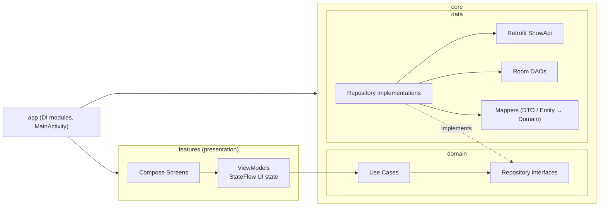

# TVPulse

TVPulse is an Android app for browsing TV shows from the public [TVmaze API](https://www.tvmaze.com/api). Browse the top 30 shows, search the full catalog, open a show's details, save favorites, and jump straight to a show with a deep link.

Built with Kotlin, Jetpack Compose, MVVM + Clean Architecture, Hilt, Retrofit and Room.

**APK download:** [app-prod-release.apk (Google Drive)](https://drive.google.com/file/d/13Tfa6Mi_A84Gidu2uzcw6vjLHgtMWsr_/view?usp=sharing)

---

## Features

- **Home:** the top 30 shows from TVmaze in a 2-column grid, cached in Room so they appear instantly and stay available offline.
- **Search:** debounced search against `/search/shows`, with a dedicated "not found" screen.
- **Detail:** title, poster, genres, runtime, status and synopsis for a show, loaded from `/shows/{id}`.
- **Favorites:** add or remove a show from its Detail page. The Favorites tab updates in real time.
- **Loading and empty states:** shimmer placeholders while loading, and illustrated empty states.
- **Error handling:** an error dialog that explains what went wrong (no internet, timeout, not found, server error, …) with a retry button.
- **Deep links:** `movieapp://detail/{id}` opens a show's Detail page, whether the app is closed or already running.

## Tech Stack

| Area | Library / Tool |
|---|---|
| Language | Kotlin 2.2.10 |
| UI | Jetpack Compose (Material 3), Navigation Compose with type-safe routes |
| Architecture | MVVM + Clean Architecture, sealed `UiState` |
| Dependency injection | Hilt |
| Network | Retrofit + Gson, OkHttp |
| Local storage | Room |
| Images & animation | Coil, Lottie |
| Async | Kotlin Coroutines, Flow / StateFlow |
| Testing | JUnit 4, kotlinx-coroutines-test |
| Build | AGP 9.3.2, Gradle 9.5, `minSdk` 24, `targetSdk` 36 |

## Architecture

The app has three Gradle modules:

| Module | Responsibility |
|---|---|
| `app` | Application entry point, `MainActivity`, Hilt modules for network and database |
| `core` | Domain and data layers: models, repository interfaces, use cases, repository implementations, Retrofit API, Room entities and DAOs, mappers |
| `features` | Presentation layer: Compose screens, ViewModels, UI state, navigation, shared components, string resources |



### Project Structure

Each module's Kotlin sources live under `<module>/src/main/java/`, in the package shown next to it.

```text
TVPulse/
├── app/              com.bookcabin.tvpulse
│   └── di/
├── core/             com.bookcabin.tvpulse.core
│   ├── common/
│   ├── show/
│   │   ├── data/     mapper, model, repository, source
│   │   └── domain/   model, repository, usecase
│   └── favorite/
│       ├── data/     mapper, model, repository, source
│       └── domain/   model, repository, usecase
└── features/         com.bookcabin.tvpulse.features
    ├── common/       components, error, state
    ├── home/         constant, state, ui, viewmodel
    ├── detail/       state, ui, viewmodel
    ├── favorite/     ui, viewmodel
    └── navigation/
```

## Getting Started

### Requirements

- A recent Android Studio release that supports AGP 9.3
- JDK 17 or newer to run Gradle (Android Studio's bundled JDK works)
- An emulator or device running Android 7.0 (API 24) or newer

### Clone and Run

```bash
git clone https://github.com/faisalramd/TVPulse.git
cd TVPulse
./gradlew :app:installDevDebug
```

Or open the project in Android Studio, pick a build variant, and press **Run**. No API key is needed, since the TVmaze API is public.

### Build Variants

The app has two product flavors, each with its own `BuildConfig.BASE_URL` (both currently `https://api.tvmaze.com/`):

| Variant | Command |
|---|---|
| `devDebug` | `./gradlew :app:installDevDebug` |
| `prodDebug` | `./gradlew :app:installProdDebug` |
| `prodRelease` | `./gradlew :app:assembleProdRelease` |

HTTP request and response logging is enabled only in debug builds.

## Deep Links

| Link | Opens |
|---|---|
| `movieapp://home` | Home tab |
| `movieapp://favorite` | Favorites tab |
| `movieapp://detail/{id}` | Detail page for the show with that TVmaze ID |

Try it from a terminal with a device or emulator connected:

```bash
adb shell am start -a android.intent.action.VIEW -d "movieapp://detail/2993"
```

## Testing

The project has 56 JVM unit tests, covering mappers, repositories, ViewModels (including the search debounce) and the error mapper. They use hand-written fakes, with no mocking library.

```bash
./gradlew :core:testDebugUnitTest :features:testDebugUnitTest
```

HTML reports are generated in `core/build/reports/tests/` and `features/build/reports/tests/`.

## Documentation

- [Project Report](PROJECT_REPORT.md): how each requirement is implemented, with file references.
- [System Design](SYSTEM_DESIGN.md): the architecture planning document.

## API

Data comes from the [TVmaze API](https://www.tvmaze.com/api):

| Feature | Endpoint |
|---|---|
| Home | `GET https://api.tvmaze.com/shows` (first 30 shows) |
| Search | `GET https://api.tvmaze.com/search/shows?q={query}` |
| Detail | `GET https://api.tvmaze.com/shows/{id}` |
